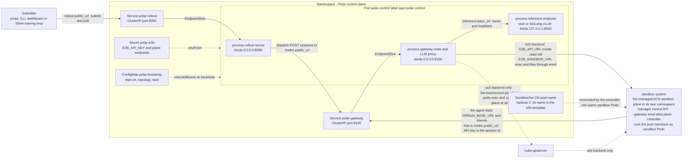

# Demo Environment: Polar Control Plane on a Self-Hosted Sandbox Stack

A complete, reproducible Polar deployment on one Kubernetes cluster: a control pod
that runs the rollout server, a gateway node and a stub inference server behind two
`ClusterIP` Services, a warm `SandboxSet` pool, and a no-model probe task that
proves the one edge remote backends add — the agent **inside a sandbox** dialing
back into the gateway.

It is
[RUNBOOK Step 4](RUNBOOK.md#step-4--deploy-the-control-plane-where-sandboxes-can-reach-it)
made concrete: the manifests and scripts below are the ones that were applied to
build the environment this branch was verified on, with every cluster-specific
value replaced by a placeholder. No addresses, keys, node names, registry hosts or
cluster identities appear in this file.

The probe in §6 needs no model server, which is what makes this environment useful
as a debugging baseline: it separates "the network path works" from "the model
works". When a real evaluation misbehaves, run §6 first.

| Placeholder | Stands for |
| --- | --- |
| `<namespace>` | Namespace holding the control plane and the pool. |
| `<kube-context>` | kubeconfig context for the cluster. |
| `<sandbox-namespace>` | Namespace where `sandbox-manager` and `sandbox-gateway` run. |
| `<source-namespace>` | Namespace where `<pull-secret>` already exists. |
| `<pool-name>` | `SandboxSet` name — also the value of `runtime.kwargs.template`. |
| `<registry>`, `<project>`, `<task-image>`, `<tag>` | A task image the cluster can pull. |
| `<pull-secret>` | `kubernetes.io/dockerconfigjson` Secret for that registry. |
| `<manager-port>`, `<gateway-port>` | Plane Service ports: E2B control API, envd data plane. |
| `<admin-key>` | The manager's admin key — read it into a variable, never commit it. |
| `<sandbox-domain>` | Domain the plane derives sandbox host names from, if any. |
| `<served-model>` | `gateway.nodes[].model_served`; the stub echoes it back. |
| `<branch-tgz>` | A `pip install`-able tarball of this branch. |

Related reading: [QUICKSTART.md](QUICKSTART.md) turns this environment into a graded
SWE evaluation, [RUNBOOK.md](RUNBOOK.md) is the full procedure including RL
training, [README.md](README.md) is the `ack` backend reference, and
[network addressing](RUNBOOK.md#network-addressing-who-must-reach-whom) tabulates
every URL by the process that dials it.

## What gets deployed

Created by this document, all in `<namespace>`:

| Piece | Kind | Name | Why it exists |
| --- | --- | --- | --- |
| Namespace | `Namespace` | `<namespace>` | Isolation for the control plane and the pool. |
| Registry credential | `Secret` (`kubernetes.io/dockerconfigjson`) | `<pull-secret>` | Copied in so pool members can pull the task image. |
| Plane credential | `Secret` | `polar-e2b` | `E2B_API_KEY`, `E2B_API_URL`, `E2B_SANDBOX_URL`, `E2B_DOMAIN`. |
| Bootstrap payload | `ConfigMap` | `polar-bootstrap` | `start.sh`, `topology.yaml`, the stub, the probe task, the submitter. |
| Control plane | `Pod` | `polar-control` | One container, three processes: rollout server, gateway node, stub inference. |
| Submitter endpoint | `Service` (`ClusterIP`) | `polar-rollout` | Port 8080 → the rollout server. |
| Sandbox endpoint | `Service` (`ClusterIP`) | `polar-gateway` | Port 8100 → the gateway node API and its LLM proxy. |
| One-shot submitter | `Job` | `polar-submit` | Per submission (§6): runs `submit.py` against `polar-rollout` and exits with the session's status. |
| Warm pool | `SandboxSet` (`agents.kruise.io/v1alpha1`) | `<pool-name>` | Its name *is* the `e2b` template; `replicas: 2`. |
| Pool members | `Sandbox` + `Pod` | `<pool-name>-xxxxx` | Created by the managed controller: `main` container plus `envd` sidecar. |

Assumed to exist already — install the plane first if it does not
([QUICKSTART §1.1](QUICKSTART.md#11-check-the-plane)):

| Piece | Kind | Where | Notes |
| --- | --- | --- | --- |
| `sandbox-manager` | `Deployment` + `Service` + `Ingress` | `<sandbox-namespace>` | The E2B control-plane API (sandboxes, templates). |
| `sandbox-gateway` | `Deployment` + `Service` | `<sandbox-namespace>` | The envd data-plane proxy, one URL for every sandbox. |
| sandbox controller | managed component | — | No in-cluster workload; the only visible trace is `sandbox-controller-manager-webhook-service`. |

## Data-plane architecture

Resource types are what make this diagram worth reading. The ACS sandbox plane is
drawn as a single box — `sandbox system` — because Polar only ever talks to its two
endpoints; what runs inside it is the plane's own business, and
[QUICKSTART §1.1](QUICKSTART.md#11-check-the-plane) is where to look when it is not.



| Node in the diagram | Kind | Created by |
| --- | --- | --- |
| `polar-rollout`, `polar-gateway` | `Service` (`ClusterIP`) | §5 |
| `polar-e2b` | `Secret` | §2 |
| `polar-bootstrap` | `ConfigMap` | §4 |
| `polar-control` | `Pod` | §5 |
| `<pool-name>` | `SandboxSet` CR (`agents.kruise.io/v1alpha1`) | §3 |
| `sandbox system` | `Deployment` + `Service` (manager and gateway), `Ingress`, a managed controller, and one `Pod` per pool member — `main` container plus `envd` sidecar, owned by a `Sandbox` CR | the plane install; pool members by the controller |
| `kube-apiserver` | built in | — |

Two faces meet in a sandbox pod:

- **LLM face.** Submitters, the CLI, the dashboard and an RL loop dial
  `rollout.public_url`; the rollout server dispatches each session to
  `nodes[].public_url`; the gateway proxies the agent's LLM calls to
  `inference.base_url`. The agent inside the sandbox is just another client of
  `nodes[].public_url`, with the session id as its API key — the one edge remote
  backends add, and the one a loopback address can never serve.
- **Execution face.** One box, two endpoints: `E2B_API_URL` to create, claim and
  kill sandboxes, and `E2B_SANDBOX_URL` to run commands and move files. A single
  data-plane URL addresses every sandbox because each request carries
  `E2b-Sandbox-Id` and `E2b-Sandbox-Port`; inside the box, `envd` in the sandbox
  pod is what actually executes. With the `ack` backend the box disappears
  entirely: `ACKRuntime` uses the kube-apiserver directly (`pods/exec` for
  commands, `cp` for files), so RBAC is the only credential —
  [README.md](README.md#rbac).

The dotted reconcile chain runs the other way: `SandboxSet` → controller → sandbox
pods. Nothing in Polar writes to it, except a claim under the `ack` backend.

## 1. Prerequisites

```bash
# cluster reachable, and the sandbox plane installed
kubectl --context <kube-context> get nodes
kubectl --context <kube-context> -n <sandbox-namespace> get deploy,svc,ingress
kubectl --context <kube-context> get crd sandboxsets.agents.kruise.io
```

Expected: `Deployment`s `sandbox-manager` and `sandbox-gateway`, a `Service` for
each (the manager serves the E2B API, the gateway serves envd traffic), optionally
an `Ingress` for access from outside the cluster, and the `agents.kruise.io` CRDs.
`<manager-port>` and `<gateway-port>` are the Service ports you see here.

| Need | Notes |
| --- | --- |
| `kubectl` + a context with namespace create/delete rights | Everything below is `kubectl`; no local Python is required for §2–§6. |
| Egress from the control pod to PyPI and to `<branch-tgz>`'s host | `start.sh` installs `polar[e2b]` on first boot. Bake it into a control image instead when the cluster has no egress. |
| `e2b` SDK `>=2.25,<2.51` | 2.51 creates sandboxes with `POST /v2/sandboxes`; a self-hosted manager that only serves v1 `POST /sandboxes` answers `405`. `polar[e2b]` already caps this. |
| A pullable task image | The pool's `main` container. Anything with `bash` works for §6. |
| Registry DNS, or a node-cached image | If the registry is not resolvable, use `imagePullPolicy: IfNotPresent` plus a hostname `nodeSelector` — [QUICKSTART §1.2](QUICKSTART.md#12-create-one-sandbox-pool-per-image). |
| `uv sync --extra e2b --extra swebench` on the laptop | Only for §7 (a real, graded run submitted from outside the cluster). |

## 2. Namespace and credentials

`namespace.yaml`:

```yaml
apiVersion: v1
kind: Namespace
metadata:
  name: <namespace>
  labels: {purpose: <namespace>}
```

```bash
kubectl --context <kube-context> apply -f namespace.yaml

# copy the registry credential the pool will need
kubectl -n <source-namespace> get secret <pull-secret> -o yaml \
  | grep -v -e '^  namespace:' -e '^  resourceVersion:' -e '^  uid:' -e '^  creationTimestamp:' \
  | kubectl -n <namespace> apply -f -
```

The plane credentials go into a `Secret` rather than an env file, because the
control pod consumes them with `envFrom` and the admin key then never lands on a
disk. Read the key straight out of the manager's arguments into a shell variable:

```bash
ADMIN_KEY=$(kubectl -n <sandbox-namespace> get deploy sandbox-manager \
  -o jsonpath='{.spec.template.spec.containers[0].args}' | tr ',' '\n' \
  | grep -o 'e2b-admin-key=[^"]*' | cut -d= -f2)

kubectl -n <namespace> create secret generic polar-e2b \
  --from-literal=E2B_API_KEY="$ADMIN_KEY" \
  --from-literal=E2B_API_URL=http://sandbox-manager.<sandbox-namespace>.svc.cluster.local:<manager-port> \
  --from-literal=E2B_SANDBOX_URL=http://sandbox-gateway.<sandbox-namespace>.svc.cluster.local:<gateway-port> \
  --from-literal=E2B_DOMAIN=<sandbox-domain>
unset ADMIN_KEY
```

These four are read by the **gateway** process, because that is where the runtime
object is built; `E2B_SANDBOX_URL` must be the sandbox *gateway*, not a Service
that selects sandbox pods — claiming a sandbox does not relabel its pod, so such a
Service has no endpoints and the first command dies with `connection refused`.
Details and the SDK smoke test:
[E2B on a self-hosted control plane](RUNBOOK.md#e2b-on-a-self-hosted-control-plane).

## 3. Sandbox pool

A self-hosted plane implements neither template builds nor alias lookup, so the
pool object *is* the template and its name is what `runtime.kwargs.template`
carries.

`pool.yaml` — its `metadata.name` is the value of `runtime.kwargs.template`:

```yaml
apiVersion: agents.kruise.io/v1alpha1
kind: SandboxSet
metadata:
  name: <pool-name>                       # == runtime.kwargs.template
  namespace: <namespace>
spec:
  replicas: 2                          # >= 2 for path A (agent + grading sandbox)
  runtimes:
    - name: agent-runtime              # injects the envd sidecar
  template:
    spec:
      automountServiceAccountToken: false
      restartPolicy: Always
      imagePullSecrets: [{name: <pull-secret>}]
      nodeSelector:
        kubernetes.io/os: linux
      containers:
        - name: main
          image: <registry>/<project>/<task-image>:<tag>
          imagePullPolicy: IfNotPresent
          command: ["sleep", "infinity"]
          resources:
            requests: {cpu: "2", memory: 4Gi, ephemeral-storage: 10Gi}
          securityContext:
            runAsUser: 0
            privileged: false
            capabilities:
              add: ["SYS_RESOURCE"]
```

```bash
kubectl apply -f pool.yaml
kubectl -n <namespace> get sandboxset <pool-name> -w    # AVAILABLE reaches replicas
kubectl -n <namespace> get pods -w | grep '^<pool-name>-'
```

Both members must reach `2/2 Running` — the second container is the `envd` sidecar
that `spec.runtimes: [{name: agent-runtime}]` injects, and it is the only way the
`e2b` backend can run anything. `replicas: 2` is the minimum for
`evaluator.refresh_runtime: true`, which uses an agent sandbox and a grading
sandbox at the same time; the no-model probe in §6 needs only one.

Four details that fail in confusing ways (`CAP_SYS_RESOURCE` plus root, selecting
members by name rather than label, `imagePullPolicy`, pool sizing) are in
[QUICKSTART §1.2](QUICKSTART.md#12-create-one-sandbox-pool-per-image).

## 4. Bootstrap ConfigMap

One `ConfigMap` carries everything the control pod and the submit Job need, so the
pod stays a stock `python:3.13-slim` and the whole deployment is rebuilt by
re-applying files. Six keys:

| Key | What it is |
| --- | --- |
| `start.sh` | The pod's entrypoint: install `polar[e2b]` if missing, kill stale processes, start the stub, the rollout server and the gateway. Idempotent, so it is safe to re-run by hand (§8). |
| `topology.yaml` | Advertised addresses only — what callers dial, not what processes bind. The one legitimate loopback is `inference.base_url`, because the stub shares the pod with the gateway. |
| `stub_inference.py` | SGLang-dialect stub on `127.0.0.1:8000`, which is what lets §6 run with no model server. |
| `probe.sh` | The §6 probe, executed inside the sandbox as the agent: echo the injected environment, dial `$ANTHROPIC_BASE_URL` over `/dev/tcp`, leave a marker in the gateway access log, post one completion. |
| `probe-task.json` | That probe as a Polar task payload. `custom_shell.command` is `"@probe.sh"` so the payload stays readable — `submit.py` inlines the file as a bash heredoc. |
| `submit.py` | Stdlib-only submitter: resolve `rollout.public_url`, POST the task, poll, print the session record, and exit non-zero unless every session is `COMPLETED`. Runs in the control pod, in a Job (§6), or on a laptop. |

`configmap.yaml` — the whole object, apply-able as-is:

```yaml
apiVersion: v1
kind: ConfigMap
metadata:
  name: polar-bootstrap
  namespace: <namespace>
data:
  start.sh: |-
    #!/bin/sh
    # Self-healing bootstrap for the Polar demo control plane (namespace <namespace>).
    # Safe to re-run: it reinstalls only when the packages are missing, and restarts
    # the three processes (stub inference, rollout server, gateway node).
    set -eu
    TGZ="<branch-tgz>"
    mkdir -p /w /data/rollout_results
    cp -f /bootstrap/topology.yaml /w/topology.yaml
    cd /w

    if ! python -c "import polar, e2b" >/dev/null 2>&1; then
      echo "[bootstrap] installing polar[e2b] from $TGZ"
      python -m pip install --quiet --no-cache-dir "polar[e2b] @ $TGZ" "e2b<2.51"
    fi
    python -c "from importlib.metadata import version; print('[bootstrap] e2b', version('e2b'))"
    # Path A (SWE-bench) needs the dataset stack; it is NOT installed by default
    # because pip's resolver spends minutes on it. Install on demand:
    #   pip install "swebench>=4,<5" datasets

    # Kill any previous instance of the three processes (slim images have no pkill).
    python - <<'EOF'
    import os, signal, pathlib
    me = os.getpid()
    for p in pathlib.Path("/proc").iterdir():
        if not p.name.isdigit() or int(p.name) == me:
            continue
        try:
            parts = [x for x in (p / "cmdline").read_bytes().decode(errors="replace").split("\x00") if x]
        except Exception:
            continue
        if not parts:
            continue
        exe = os.path.basename(parts[0])
        if (exe == "polar" and len(parts) > 1 and parts[1] in ("serve_rollout", "serve_gateway")) \
           or (exe.startswith("python") and any("stub_inference.py" in x for x in parts)):
            try:
                os.kill(int(p.name), signal.SIGKILL)
                print("[bootstrap] stopped pid", p.name, " ".join(parts[1:3]))
            except Exception:
                pass
    EOF
    sleep 2

    # Stub inference in the SGLang dialect (RUNBOOK appendix), so the documented
    # loopback inference.base_url has something behind it. For a model-backed demo,
    # point gateway.nodes[].inference.base_url at a real SGLang/vLLM endpoint instead.
    (nohup python -u /bootstrap/stub_inference.py > /tmp/stub.log 2>&1 &)
    (nohup polar serve_rollout -c /w/topology.yaml > /tmp/rollout.log 2>&1 &)
    sleep 3
    (nohup polar serve_gateway -c /w/topology.yaml --node-id node-01 > /tmp/gateway.log 2>&1 &)
    sleep 10

    echo "[bootstrap] rollout.log:"; tail -3 /tmp/rollout.log || true
    echo "[bootstrap] gateway.log:"; tail -3 /tmp/gateway.log || true
    python - <<'EOF' || true
    import json, urllib.request as u
    nodes = json.loads(u.urlopen("http://polar-rollout.<namespace>.svc.cluster.local:8080/nodes", timeout=20).read())
    print("[bootstrap] nodes:", [(n["node_id"], n["gateway_url"], n["healthy"]) for n in nodes])
    h = json.loads(u.urlopen("http://polar-gateway.<namespace>.svc.cluster.local:8100/health", timeout=20).read())
    print("[bootstrap] gateway health:", h.get("status"), "| inference:", h.get("inference"))
    EOF
    echo "[bootstrap] ready — smoke test: python /bootstrap/submit.py /bootstrap/probe-task.json --fresh"
  topology.yaml: |-
    rollout:
      host: 0.0.0.0                # bind every interface, so the Service can reach it
      port: 8080
      # Dialed by submitters, the CLI, the dashboard and the gateways: it has to
      # resolve from wherever those run, which is why this is a cluster DNS name.
      public_url: http://polar-rollout.<namespace>.svc.cluster.local:8080
      save_dir: /data/rollout_results
    gateway:
      # Optional — defaults to rollout.public_url. Set it only when the gateway
      # reaches the rollout server some other way (another namespace, an ingress).
      rollout_server_url: http://polar-rollout.<namespace>.svc.cluster.local:8080
      nodes:
        - id: node-01
          host: 0.0.0.0
          port: 8100
          # Dialed twice: by the rollout server for session dispatch, and by the
          # agent inside the sandbox, where it becomes OPENAI_BASE_URL /
          # ANTHROPIC_BASE_URL / GOOGLE_API_URL. Never loopback in a real run.
          public_url: http://polar-gateway.<namespace>.svc.cluster.local:8100
          model_served: <served-model>
          # Loopback is right *here* only because this example runs the inference
          # engine in the same pod as the gateway; otherwise use its Service name.
          inference: {engine: sglang, base_url: "http://127.0.0.1:8000"}
  stub_inference.py: |-
    """Minimal SGLang-dialect stub (RUNBOOK appendix shape) for network verification."""
    import json, time, itertools
    from http.server import BaseHTTPRequestHandler, ThreadingHTTPServer

    ids = itertools.count(1)

    class Handler(BaseHTTPRequestHandler):
        def _send(self, code, payload):
            body = json.dumps(payload).encode()
            self.send_response(code)
            self.send_header("Content-Type", "application/json")
            self.send_header("Content-Length", str(len(body)))
            self.end_headers()
            self.wfile.write(body)

        def do_GET(self):
            self._send(200, {"status": "ok", "stub": True})

        def do_POST(self):
            length = int(self.headers.get("Content-Length") or 0)
            raw = self.rfile.read(length) if length else b"{}"
            try:
                req = json.loads(raw or b"{}")
            except json.JSONDecodeError:
                req = {}
            n = next(ids)
            print(f"[stub] {self.path} model={req.get('model')} msgs={len(req.get('messages') or [])}", flush=True)
            self._send(200, {
                "id": f"stub-{n}", "object": "chat.completion", "model": req.get("model", "<served-model>"),
                "created": int(time.time()),
                "choices": [{
                    "index": 0,
                    "message": {"role": "assistant", "content": "stub completion ok"},
                    "finish_reason": "stop",
                    "prompt_token_ids": [1, 2, 3],
                    "logprobs": {"content": [{"text": "stub", "token_id": 10, "logprob": -0.01}]},
                    "meta_info": {"output_token_logprobs": [[-0.01, 10, "stub"]]},
                }],
                "usage": {"prompt_tokens": 3, "completion_tokens": 1, "total_tokens": 4},
            })

        def log_message(self, *args):
            pass

    ThreadingHTTPServer(("127.0.0.1", 8000), Handler).serve_forever()
  probe.sh: |-
    set -u
    hostport="${ANTHROPIC_BASE_URL#http://}"; hostport="${hostport%%/*}"
    h="${hostport%:*}"; p="${hostport##*:}"
    echo "=== injected env (inside sandbox) ==="
    env | grep -E '^(OPENAI_BASE_URL|ANTHROPIC_BASE_URL|GOOGLE_API_URL|SESSION_ID|TASK_ID)=' | sort
    echo "=== dialing the gateway from the sandbox: $h:$p ==="
    if exec 3<>"/dev/tcp/$h/$p"; then
      printf 'GET /health HTTP/1.1\r\nHost: %s\r\nConnection: close\r\n\r\n' "$hostport" >&3
      echo "--- GET /health:"; head -c 260 <&3; echo; exec 3<&-
    else
      echo "TCP CONNECT FAILED"; exit 1
    fi
    mark=$(printf '%s' "$OPENAI_BASE_URL" | tr '/:' '__')
    if exec 4<>"/dev/tcp/$h/$p"; then
      printf 'GET /health?probe=%s HTTP/1.1\r\nHost: %s\r\nConnection: close\r\n\r\n' "$mark" "$hostport" >&4
      head -c 40 <&4 >/dev/null; exec 4<&-
    fi
    body='{"model":"<served-model>","messages":[{"role":"user","content":"ping"}],"stream":false}'
    if exec 5<>"/dev/tcp/$h/$p"; then
      printf 'POST /v1/chat/completions HTTP/1.1\r\nHost: %s\r\nContent-Type: application/json\r\nAuthorization: Bearer %s\r\nContent-Length: %d\r\nConnection: close\r\n\r\n%s' "$hostport" "$OPENAI_API_KEY" "${#body}" "$body" >&5
      echo "--- POST /v1/chat/completions:"; head -c 300 <&5; echo; exec 5<&-
    fi
    echo "=== probe done ==="
  probe-task.json: |-
    {
      "task_id": "demo-net-probe",
      "instruction": "Report the injected gateway address and prove it is reachable from inside the sandbox.",
      "num_samples": 1,
      "timeout_seconds": 900,
      "runtime": {
        "backend": "e2b",
        "image": "<registry>/<project>/<task-image>:<tag>",
        "workdir": "/polar/session/workspace",
        "kwargs": {
          "template": "<pool-name>",
          "user": "root"
        },
        "prepare": [
          {
            "type": "exec",
            "command": "mkdir -p /polar/session/workspace && echo PREPARED"
          }
        ]
      },
      "agent": {
        "harness": "shell",
        "model_name": "<served-model>",
        "custom_shell": {
          "command": "@probe.sh"
        }
      },
      "evaluator": {
        "strategy": "session_completed",
        "refresh_runtime": false
      }
    }
  submit.py: |-
    """Submit a task JSON to the rollout server, then poll until the session finishes.

    Usage: python submit.py [task.json] [--fresh]
      --fresh  suffix task_id with the time (task_id is the idempotency key)

    A payload whose agent.custom_shell.command is "@<file>" gets that file inlined as
    a bash heredoc, so a long probe script stays a readable file instead of an escaped
    one-liner inside the JSON.

    Runs anywhere Python 3 does — in the control pod, in a one-shot Job, on a laptop.
    Stdlib only: the rollout URL comes from $POLAR_ROLLOUT_URL, else from
    rollout.public_url of $POLAR_TOPOLOGY (or the first of /w/topology.yaml,
    /bootstrap/topology.yaml, ./topology.yaml that exists), read through polar when it
    is installed and by a plain scan when it is not.
    """
    import json, os, re, sys, time, urllib.request as u
    from pathlib import Path

    CANDIDATES = ("/w/topology.yaml", "/bootstrap/topology.yaml", "topology.yaml")


    def topology_path():
        explicit = os.environ.get("POLAR_TOPOLOGY")
        for candidate in (explicit,) if explicit else CANDIDATES:
            if candidate and Path(candidate).exists():
                return Path(candidate)
        return None


    def rollout_url():
        if os.environ.get("POLAR_ROLLOUT_URL"):
            return os.environ["POLAR_ROLLOUT_URL"].rstrip("/")
        path = topology_path()
        if path is None:
            raise SystemExit("set POLAR_ROLLOUT_URL, or make a topology.yaml readable")
        try:
            from polar.config import TopologyConfig

            return TopologyConfig.load(str(path)).rollout.public_url
        except ImportError:
            pass
        text = path.read_text()
        block = re.search(r"^rollout:\n((?:[ \t]+.*\n?)+)", text, re.M)
        match = re.search(r"public_url:\s*[\"']?([^\"'\n#]+)", block.group(1) if block else text)
        if match is None:
            raise SystemExit(f"no rollout.public_url in {path}")
        return match.group(1).strip()


    def main():
        args = [a for a in sys.argv[1:] if not a.startswith("--")]
        path = Path(args[0]) if args else Path("/bootstrap/probe-task.json")
        url = rollout_url()
        payload = json.loads(path.read_text())
        shell = ((payload.get("agent") or {}).get("custom_shell") or {})
        if str(shell.get("command", "")).startswith("@"):
            # "@probe.sh" — inline the script beside the task file, so the payload
            # stays readable instead of carrying a 1 KB escaped one-liner.
            script = (path.parent / shell["command"][1:]).read_text().rstrip("\n")
            shell["command"] = "bash -s <<'PROBE'\n\n" + script + "\nPROBE\n"
        if "--fresh" in sys.argv:
            payload["task_id"] = f'{payload["task_id"]}-{time.strftime("%H%M%S")}'
        print("submitting", payload["task_id"], "->", url, flush=True)
        req = u.Request(url + "/rollout/task/submit", data=json.dumps(payload).encode(),
                        headers={"Content-Type": "application/json"})
        print("submit ->", u.urlopen(req, timeout=60).read()[:200].decode(), flush=True)
        tid, st = payload["task_id"], {}
        for _ in range(240):
            st = json.loads(u.urlopen(f"{url}/rollout/task/{tid}", timeout=60).read())
            print(time.strftime("%H:%M:%S"), st["status"],
                  f'{st["completed_sessions"]}/{st["total_sessions"]}', flush=True)
            if st["total_sessions"] and st["completed_sessions"] >= st["total_sessions"]:
                break
            time.sleep(5)
        failed = st.get("status") != "completed"
        for r in st.get("results", []):
            traj = r.get("trajectory") or {}
            ev = (traj.get("metadata") or {}).get("evaluation") or {}
            print("session:", r.get("session_id"), "| status:", r.get("status"),
                  "| error:", r.get("error"), "| reward:", ev.get("outcome_reward"),
                  "| traces:", len(traj.get("traces") or []))
            print("timing:", {k: round(v / 1000, 1) for k, v in (r.get("timing") or {}).items()})
            # a task can reach "completed" while its sessions errored — fail on that too
            if r.get("status") != "COMPLETED" or r.get("error"):
                failed = True
        raise SystemExit(1 if failed else 0)


    main()
```

```bash
kubectl apply -f configmap.yaml
```

Reading the block: every key is a `|-` literal block scalar, so the four-space
indent belongs to the YAML, not to the file — what appears in `/bootstrap` is the
dedented content. Copying a script out of this block by hand therefore needs a
dedent; the file-based form below avoids that and produces the identical object:

```bash
# six files in ./demo, same ConfigMap
kubectl -n <namespace> create configmap polar-bootstrap \
  --from-file=demo/start.sh --from-file=demo/topology.yaml --from-file=demo/stub_inference.py \
  --from-file=demo/probe.sh --from-file=demo/probe-task.json --from-file=demo/submit.py \
  --dry-run=client -o yaml | kubectl apply -f -
```

Three properties of this object worth knowing: a `ConfigMap` is capped at 1 MiB,
which is why the payload is scripts rather than a wheel; the mounts need
`defaultMode: 0755` (§5, §6) for `/bootstrap/start.sh` to be executable; and an
edited key propagates into running pods within about a minute, because no mount
uses `subPath` — but the three processes read `topology.yaml` only at startup, so
re-run `/bootstrap/start.sh` after changing it.

## 5. Control pod and Services

`control-pod.yaml`:

```yaml
apiVersion: v1
kind: Pod
metadata:
  name: polar-control
  namespace: <namespace>
  labels: {app: polar-control}          # both Services select this pod
spec:
  restartPolicy: Always
  containers:
    - name: control
      image: python:3.13-slim
      # Installs polar from the branch (if missing), then starts stub inference,
      # the rollout server and the gateway node. Re-runnable by hand.
      command: ["/bin/sh", "-c"]
      args: ["/bootstrap/start.sh; exec sleep infinity"]
      envFrom: [{secretRef: {name: polar-e2b}}]
      ports:
        - {name: rollout, containerPort: 8080}
        - {name: gateway, containerPort: 8100}
      resources:
        requests: {cpu: "1", memory: 2Gi}
        limits: {cpu: "2", memory: 4Gi}
      volumeMounts: [{name: bootstrap, mountPath: /bootstrap}]
  volumes:
    - name: bootstrap
      configMap: {name: polar-bootstrap, defaultMode: 0755}
```

`services.yaml`:

```yaml
apiVersion: v1
kind: Service
metadata: {name: polar-rollout, namespace: <namespace>}
spec:
  selector: {app: polar-control}
  ports: [{name: rollout, port: 8080, targetPort: 8080}]   # submit, poll, results
---
apiVersion: v1
kind: Service
metadata: {name: polar-gateway, namespace: <namespace>}
spec:
  selector: {app: polar-control}
  ports: [{name: gateway, port: 8100, targetPort: 8100}]   # node API + LLM proxy
```

```bash
kubectl apply -f control-pod.yaml -f services.yaml
kubectl -n <namespace> wait --for=condition=Ready pod/polar-control --timeout=300s
kubectl -n <namespace> logs polar-control --tail=20
```

Design notes worth keeping:

- **One pod, three processes, two Services.** Both Services select
  `app: polar-control`; the *port* is what picks the process. Splitting rollout and
  gateway into separate pods also works — nothing but `public_url` couples them —
  but one pod is the smallest thing that exercises every edge.
- **`host: 0.0.0.0` versus `public_url`.** The first is what the process binds, the
  second is what its callers dial. A `ClusterIP` Service only reaches a process
  bound on all interfaces, and a sandbox pod can only reach a name that resolves
  cluster-wide — which is why `public_url` is a `svc.cluster.local` name and never
  loopback. The one legitimate loopback here is `inference.base_url`, because the
  stub shares the pod with the gateway. Full table:
  [network addressing](RUNBOOK.md#network-addressing-who-must-reach-whom).
- **A bare `Pod`, not a `Deployment`.** Deliberate for a demo: `start.sh` is the
  interesting part and re-running it by hand is easier than editing a spec. The
  cost is that `rollout.save_dir` (`/data/rollout_results`) lives in the container
  filesystem, so results die with the pod — attach a `PersistentVolumeClaim` or
  copy results out before restarting anything you care about.
- **`envFrom: polar-e2b`** is what puts the plane endpoints in the gateway process
  environment; the pod spec carries no credential of its own.

## 6. Verify

The probe is one session, needs no model server, and takes about ten seconds once
the pool is warm. Run it as a `Job` — that is the reproducible form: it depends on
nothing but the ConfigMap and the two Services, and because `submit.py` is
stdlib-only the image needs no install step.

`submit-job.yaml`:

```yaml
apiVersion: batch/v1
kind: Job
metadata:
  name: polar-submit                    # one Job per submission — delete or rename to re-run
  namespace: <namespace>
spec:
  backoffLimit: 0                       # fail visibly; a retry would resubmit the same task_id
  # ttlSecondsAfterFinished: 600        # optional auto-cleanup — it takes the logs with it
  template:
    spec:
      restartPolicy: Never
      containers:
        - name: submit
          image: python:3.13-slim       # submit.py is stdlib-only, so no install step
          command: ["python", "/bootstrap/submit.py", "/bootstrap/probe-task.json", "--fresh"]
          env:
            - {name: POLAR_TOPOLOGY, value: /bootstrap/topology.yaml}
            # overrides the topology — e.g. a laptop tunnel, or another namespace's Service
            # - {name: POLAR_ROLLOUT_URL, value: "http://polar-rollout.<namespace>.svc.cluster.local:8080"}
          volumeMounts: [{name: bootstrap, mountPath: /bootstrap}]
      volumes:
        - name: bootstrap
          configMap: {name: polar-bootstrap, defaultMode: 0755}
```

```bash
kubectl -n <namespace> delete job polar-submit --ignore-not-found
kubectl apply -f submit-job.yaml
kubectl -n <namespace> wait --for=condition=Complete job/polar-submit --timeout=300s
kubectl -n <namespace> logs job/polar-submit
```

Expected — `--fresh` suffixes `task_id`, which is the idempotency key, so re-runs
never collide:

```text
submitting demo-net-probe-<HHMMSS> -> http://polar-rollout.<namespace>.svc.cluster.local:8080
submit -> {"task_id":"demo-net-probe-<HHMMSS>","status":"running"}
10:01:06 running 0/1
10:01:11 completed 1/1
session: sk-polar-<uuid> | status: COMPLETED | error: None | reward: 1.0 | traces: 1
```

The Job's exit status *is* the session's: `submit.py` exits non-zero unless every
session reports `COMPLETED` with no error, so `kubectl wait --for=condition=Complete`
is the assertion and `backoffLimit: 0` keeps a failure visible instead of
resubmitting the same `task_id`. A task can reach `completed` while its sessions
errored — checking only the task status is how a red run hides behind a green Job.
A `Job` spec is immutable once created, hence the `delete` before every re-run — or
give each run its own name (`polar-submit-<HHMMSS>`), which keeps the logs of
previous runs around.

Faster iteration on the same payload, without a Job:

```bash
kubectl -n <namespace> exec polar-control -- \
  python /bootstrap/submit.py /bootstrap/probe-task.json --fresh
```

`reward: 1.0` here comes from `evaluator.strategy: session_completed` — it means the
session ran to the end without an error, not that a patch was graded. `traces: 1`
means the LLM proxy captured the agent's completion call, so the trace carries
`prompt_ids`, `response_ids` and `response_logprobs` (what an RL loop consumes).

The authoritative evidence is the gateway access log:

```bash
kubectl -n <namespace> exec polar-control -- \
  sh -c 'grep -E "probe=|chat/completions" /tmp/gateway.log | tail -4'
kubectl -n <namespace> get pods -o wide | grep '^<pool-name>-'
```

```text
INFO:  <sandbox-pod-ip>:40970 - "GET /health?probe=http___polar-gateway.<namespace>.svc.cluster.local_8100_v1 HTTP/1.1" 200 OK
INFO polar.gateway.server: POST /v1/chat/completions | api=openai_chat model=<served-model> session=sk-polar-<uuid>
INFO:  <sandbox-pod-ip>:40984 - "POST /v1/chat/completions HTTP/1.1" 200 OK
```

Read those three lines together:

- The source address equals a `<pool-name>-xxxxx` pod IP, so the request came from
  **inside a sandbox**, not from the control pod. A check run on the control pod
  proves nothing about the sandbox's view of the network.
- The `probe=` marker is `$OPENAI_BASE_URL` with `/` and `:` translated to `_`, i.e.
  the sandbox reports back the exact address the gateway injected.
- `POST /v1/chat/completions → 200` means the proxy forwarded to
  `inference.base_url` and got an answer, so the LLM face is complete end to end.

The probe's own stdout is *not* in the persisted session record — the `shell`
harness does not keep it — so do not go looking for it under `save_dir`.

Two more edges, both cheap:

```bash
# node registration, as seen from a different namespace
kubectl -n <sandbox-namespace> run net-check --rm -i --restart=Never --image=python:3.13-slim -- \
  python -c 'import urllib.request as u; print(u.urlopen("http://polar-rollout.<namespace>.svc.cluster.local:8080/nodes", timeout=10).read()[:300])'

# the laptop view: a tunnel for the submitter only
kubectl -n <namespace> port-forward svc/polar-rollout 18081:8080 &
curl -s http://127.0.0.1:18081/nodes | head -c 300
```

`127.0.0.1:18081` is a **test-only** value that names the tunnel and dies with it.
It is safe for a submitter, which reads nothing but `rollout.public_url` from its
own copy of the topology, and unsafe for `nodes[].public_url`, which a sandbox pod
has to resolve — loopback there names the sandbox itself.

## 7. Drive it with a real model and a real dataset

This environment is deliberately model-free. To make it a real evaluation rig:

1. **Point the gateway at an inference engine.** Edit `topology.yaml` in the
   ConfigMap — `gateway.nodes[].inference.engine` (`sglang` or `vllm`) and
   `base_url` — then re-apply and re-run `/bootstrap/start.sh`. Loopback stays
   correct only while the engine is co-located with the gateway; otherwise use its
   `Service` DNS name. The stub answers in the SGLang dialect with a canned
   completion, so model output is the one thing it cannot demonstrate — see the
   runbook's
   [smoke-testing appendix](RUNBOOK.md#appendix-smoke-testing-without-a-model-server).
2. **Install the dataset stack, on demand.** Path A (HuggingFace rows) needs
   `pip install "swebench>=4,<5" datasets` inside the control pod. `start.sh` skips
   it because pip's resolver spends minutes on it and §6 does not need it.
3. **Submit a graded run.** Convert a dataset and run it exactly as documented —
   [QUICKSTART §2](QUICKSTART.md#2-convert-the-dataset) and
   [QUICKSTART §5](QUICKSTART.md#5-run) — from inside the control pod, or from the
   laptop through the tunnel above — or copy the §6 `Job` and swap its `command`
   for the example submitter, using an image that already has `polar[swebench]`
   (a `pip install` in `command` works too, it just pays the resolver on every
   run) and a `PersistentVolumeClaim` for the dataset cache. The task payload
   carries its own `runtime`
   block, so `backend`, `image`, `kwargs.template` and `prepare` are per task, not
   per deployment: one dataset may span several images
   ([One dataset, many images](RUNBOOK.md#one-dataset-many-images)).
4. **Or use the native `ack` backend.** Swap `runtime.backend` to `ack`, give the
   control pod a `ServiceAccount` with `pods/exec` and `pods/cp` rights, and drop
   the `polar-e2b` Secret — there is no plane to talk to. Allocation modes and RBAC:
   [README.md](README.md#allocation-modes).

## 8. Restart and self-heal

```bash
# restart the three processes only — seconds, no reinstall
kubectl -n <namespace> exec polar-control -- /bootstrap/start.sh

# rebuild the container — about a minute, reinstalls polar[e2b] from <branch-tgz>
kubectl -n <namespace> delete pod polar-control && kubectl apply -f control-pod.yaml

# rebuild the pool — the controller recreates both members
kubectl -n <namespace> delete sandboxset <pool-name> && kubectl apply -f pool.yaml
```

`start.sh` kills the previous rollout/gateway/stub processes before starting new
ones (a slim image has no `pkill`, so it scans `/proc`), which makes it safe to
re-run after editing the ConfigMap. `restartPolicy: Always` covers a crashing
container; a *deleted* pod needs the `apply` above, and a `Deployment` would make
that automatic if you want this environment to survive node drains.

## 9. Teardown

The environment is meant to stay up between demos; tear it down only when it is
really finished.

```bash
kubectl -n <namespace> delete job polar-submit --ignore-not-found
kubectl -n <namespace> delete sandboxset <pool-name>
kubectl -n <namespace> delete pod polar-control
kubectl -n <namespace> delete svc polar-rollout polar-gateway
kubectl -n <namespace> delete cm polar-bootstrap
kubectl -n <namespace> delete secret polar-e2b <pull-secret>
kubectl delete ns <namespace>          # or keep the namespace for the next run
```

Before deleting anything, confirm no sandbox leaked (re-read the admin key into
`ADMIN_KEY` as in §2):

```bash
curl -s -H "X-API-KEY: $ADMIN_KEY" \
  http://sandbox-manager.<sandbox-namespace>.svc.cluster.local:<manager-port>/v2/sandboxes
```

An empty list means `stop()` → `sandbox.kill()` cleaned up after every session and
the pool refilled its warm replicas. Anything left behind is a session that died
mid-run.

## Verified evidence

What this exact layout was observed doing, with cluster identity removed:

- Pool: `SandboxSet` at `AVAILABLE 2/2`, both members `2/2 Running` with the `envd`
  sidecar injected by `runtimes: [{name: agent-runtime}]`.
- Plane API: `POST /sandboxes` (v1) → `201`; `POST /v2/sandboxes` → `405 Method Not
  Allowed`; `GET /v2/sandboxes` → `200`. Hence the `e2b<2.51` cap, and hence
  `kwargs.template` must name a pool that already exists.
- Control plane: `polar serve_rollout` and `polar serve_gateway` both from one
  `python:3.13-slim` container, `polar[e2b]` installed from a branch tarball, `e2b`
  SDK pinned at 2.50.0. `GET /nodes` returned the node with its `polar-gateway`
  callback URL — from the control pod, from a pod in another namespace, and through
  a laptop `port-forward`.
- Probe session: `COMPLETED`, `error: None`, reward `1.0`, one trace carrying
  `prompt_ids`, `response_ids` and `response_logprobs`; the gateway log shows the
  `probe=` marker and `POST /v1/chat/completions → 200` arriving from a pool
  member's pod IP, proxied to the co-located stub.
- Submitter as a `Job`: `polar-submit` on a bare `python:3.13-slim` image, no
  install step, `succeeded=1` about 10 s after apply, logs carrying the same
  `COMPLETED` / reward `1.0` / `traces: 1` line as the in-pod run.
- The same `Job` with `kwargs.template` pointing at a pool that does not exist:
  the session errors with `runtime initialization failed: 400: Template or
  Checkpoint not found`, `submit.py` exits 1, the Job ends `failed=1`, and
  `kubectl wait --for=condition=Complete` times out — a bad template cannot pass
  as a green run.
- Graded runs on the same plane: HuggingFace row `pylint-dev__pylint-4661` resolved
  with reward `1.0`, and Harbor task `adaptive-rejection-sampler` resolved with
  reward `1.0` — both through the `e2b` backend, documented in
  [QUICKSTART.md](QUICKSTART.md).
