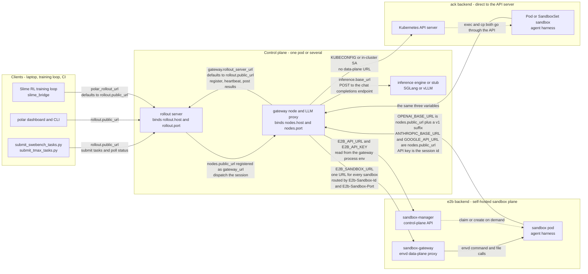

# Runbook: Remote Sandbox Runtimes — SWE Evaluation and RL Training

How to run rollouts end to end when the sandbox lives on a **remote** runtime
backend — `ack` (Kubernetes pods, optionally OpenKruise warm-pool sandboxes) or
`e2b` — instead of local Docker or Apptainer.

Steps 1–9 walk a single SWE-bench-style evaluation. Driving the same backends
from a training loop is covered separately in
[RL training](#rl-training-against-a-remote-runtime-slime).

Everything below is backend-agnostic unless a step says otherwise. Cluster
specifics are written as placeholders: `<namespace>`, `<kube-context>`,
`<registry>`, `<control-host>`.

Backend-specific references: [ACK](README.md) — RBAC, kwargs, OpenKruise pool
lifecycle, teardown, and ACK-only troubleshooting.

Command-first walkthrough of the same stack, for both dataset formats
(HuggingFace rows and Harbor task directories):
[QUICKSTART.md](QUICKSTART.md).

Step 4 as a ready-made deployment — manifests, bootstrap ConfigMap, warm pool and
a no-model probe task that verifies every edge: [DEMO.md](DEMO.md).

Related reading: [runtime backends](../README.md),
[gateway](../../gateway/README.md), [evaluators](../../trajectory/evaluator/README.md),
[the SWE-bench example](../../../../examples/swebench_verified/README.md).

## Why remote changes the topology

With Docker/Apptainer the gateway and the sandbox share a filesystem, so the
gateway can write a file into the session directory and the runtime sees it
through a bind mount. Remote backends have **no bind mount**, and the agent
inside the sandbox must reach the gateway over the network — the gateway injects
`OPENAI_BASE_URL` / `ANTHROPIC_BASE_URL` / `GOOGLE_API_URL` (with the API key set
to the session id) and transparently proxies every LLM call.

Two consequences drive the whole runbook:

1. **The gateway's `public_url` must be resolvable and reachable from inside the
   sandbox.** Running the control plane on a laptop and the sandbox in a cluster
   does not work without an inbound tunnel. The simplest reliable layout is to
   run the control plane *in the same cluster* and expose the gateway through a
   `ClusterIP` Service.
   Every URL field, its caller, and which values are test-only are tabulated in
   [network addressing](#network-addressing-who-must-reach-whom).
2. **Files staged for an in-runtime command must be pushed, not written.** Use
   `BaseRuntime.publish_file()`; see [the runtime contract](#runtime-contract).

```
  submit ──▶ rollout server ──▶ gateway node ──┬──▶ runtime (ACK sandbox / E2B)
   (you)         (control)         (control)   │        │  agent harness
                                               │        ▼
                                               └── LLM proxy ◀── agent calls
                                                         │
                                                         ▼
                                                   inference server
```

### Network addressing: who must reach whom

Every URL in `topology.yaml` is an **advertised address**, not a listen address:
`host`/`port` say what a process binds, while a `public_url` says where that
process's *callers* dial. Whether a loopback value can possibly work therefore
depends on who the caller is, edge by edge:



| Edge | Set by | Caller, and what a wrong address costs you |
| --- | --- | --- |
| submitter → rollout | `rollout.public_url` | `submit_*_tasks.py` (`examples/swebench_verified/submit_swebench_tasks.py:284`), the CLI (`src/polar/cli.py:342`), the dashboard (`src/polar/platform/config.py:33`). |
| training loop → rollout | `polar_rollout_url`, else `rollout.public_url` of `polar_topology_path` | The Slime bridge (`src/slime_bridge/config.py:41`). |
| rollout → training loop | `polar_callback_host` | Result callbacks into the bridge's listener (`src/slime_bridge/rollout.py:619`). |
| gateway → rollout | `gateway.rollout_server_url`; defaults to `rollout.public_url` (`src/polar/config/topology.py:176`) | Registration, heartbeats, result posting. |
| rollout → gateway | `gateway.nodes[].public_url`, registered as `gateway_url` (`src/polar/gateway/server.py:103`) | Session dispatch: `POST {gateway_url}/sessions` (`src/polar/rollout/pipeline.py:193`). |
| **sandbox → gateway** | the same `gateway.nodes[].public_url`, injected as `OPENAI_BASE_URL` (plus a `/v1` suffix), `ANTHROPIC_BASE_URL` and `GOOGLE_API_URL`, with the session id as the API key (`src/polar/gateway/node.py:767`) | The agent harness **inside the sandbox pod**. This is the edge remote backends add, and the one loopback can never serve: `127.0.0.1` inside a sandbox is the sandbox itself. Use a Service DNS name, a routable node IP, or an ingress host. |
| gateway → inference | `gateway.nodes[].inference.base_url` | The proxy's upstream `POST /v1/chat/completions` (`src/polar/gateway/proxy.py:126`). Loopback is *correct* here when the engine runs beside the gateway. |
| gateway → sandbox-manager | `E2B_API_URL`, plus `E2B_API_KEY` | `e2b` only, read from the gateway process environment. |
| gateway → sandbox-gateway | `E2B_SANDBOX_URL` | `e2b` only — one URL for every sandbox, routed by request headers; see [E2B on a self-hosted control plane](#e2b-on-a-self-hosted-control-plane). |
| gateway → API server | `KUBECONFIG`, or the in-cluster ServiceAccount | `ack` only. There is no data-plane URL: exec and file copy both go through the API server. |

> **`127.0.0.1` or `localhost` in `rollout.public_url`, `nodes[].public_url` or
> `polar_callback_host` is a test-only value.** It works only where every caller
> shares one network namespace: the shipped single-host examples
> (`examples/count_stars/topology.vllm.yaml`, whose local Docker runtime requests
> `network: host`), or a laptop `port-forward` that the submitter alone uses. A
> remote sandbox pod is a separate namespace by construction, so a loopback
> `nodes[].public_url` names the sandbox itself and the agent's very first LLM
> call fails. More generally, once any process moves to another pod or host,
> loopback resolves to the *caller's* own interface instead, and the failure
> surfaces far from its cause. Leaving `public_url` blank inherits the same trap:
> it is derived from `host:port`, and the bind-all addresses `0.0.0.0`/`::`
> derive `http://127.0.0.1:<port>` (`src/polar/config/topology.py:221`). The one
> loopback that stays legitimate in a real deployment is `inference.base_url`,
> when the inference engine is co-located with the gateway.

Symptoms, mapped back to the edge that is actually broken:

| Symptom | Broken edge |
| --- | --- |
| `GET /nodes` returns `[]`, or nodes flap in and out | gateway → rollout |
| Nodes registered, but tasks never leave `PENDING` or `INIT` | rollout → gateway dispatch |
| The session starts, the agent emits nothing, and its first LLM call times out | sandbox → gateway; retest from a pod **in the cluster**, not from a laptop |
| Under RL, results arrive only after a long delay instead of instantly | rollout → training-loop callback (falls back to polling) |

Proving the sandbox → gateway edge without a model: submit one task whose
`agent.harness` is `shell` and whose `custom_shell` dials
`$ANTHROPIC_BASE_URL/health`, echoing `$OPENAI_BASE_URL` back as a query
parameter. A bash `/dev/tcp` redirect is enough — task images often ship no
`curl`, `wget` or `python3`. The gateway's access log then shows the injected
value, and the request's source IP is the sandbox pod's: a check run from the
control pod proves nothing about the sandbox's view of the network.

## Prerequisites

| Need | Notes |
| --- | --- |
| `polar[ack]` or `polar[e2b]` | `uv sync --extra ack --extra swebench`. The `e2b` extra is capped at `<2.51` — 2.51 needs a v2 sandbox-create endpoint that self-hosted planes lack. |
| `swebench` **>=4,<5** | 5.x removed `swebench.harness.test_spec`, which `swebench_harness` imports. `uv.lock` pins a working version; a bare `pip install polar[swebench]` may not. |
| Cluster access | `ack` only: a kubeconfig context, or an in-cluster ServiceAccount, with the [RBAC](README.md#rbac) granted. |
| A pullable image | Remote backends never build. `spec.image` must already exist in a registry the cluster can pull. |
| Inference endpoint | SGLang or vLLM (OpenAI-compatible). See [the appendix](#appendix-smoke-testing-without-a-model-server) for a stub. |

## Step 1 — Cluster RBAC

*`ack` only — `e2b` needs an `E2B_API_KEY` instead and has no cluster step.* The
ready-to-apply Role, the verbs it grants and the 403 failure mode are in
[ACK → RBAC](README.md#rbac).

## Step 2 — Choose the allocation mode

| Mode | `kwargs` | Start latency | Scales to many distinct images | Use when |
| --- | --- | --- | --- | --- |
| ACK Pod | — | image pull + schedule | yes | one-off runs, no OpenKruise in the cluster, per-instance images |
| ACK SandboxClaim | `use_sandbox_claim: true` | seconds (warm pool) | no — one pool per image | many concurrent rollouts over a **small** set of images |
| E2B | — | template build once, then seconds | no — one build per image | no cluster of your own, or a self-hosted E2B control plane |

Any warm pool must be sized for **two sandboxes per session** when
`evaluator.refresh_runtime` is true — one for the agent, one fresh one for
grading — and an undersized pool degrades to on-demand creation rather than
failing, so you lose warm starts at peak load without seeing an error. The ACK
pool lifecycle, claim→sandbox resolution and teardown semantics are in
[ACK → OpenKruise SandboxSet / SandboxClaim](README.md#openkruise-sandboxset--sandboxclaim).

## Step 3 — Runtime spec

`RuntimeSpec` is the only configuration surface, and it is **per task**: every
`TaskRequest` carries its own `runtime` block
(`src/polar/rollout/models.py:66`), and the gateway prefers it over the node's
`default_runtime` (`src/polar/gateway/node.py:251`). `default_runtime` in
`topology.yaml` is only a fallback for requests that omit `runtime` — it is not a
global setting, so a single deployment can run many different images at once
(see [One dataset, many images](#one-dataset-many-images)).

Fields that matter remotely:

```yaml
runtime:
  backend: "ack"                       # or "e2b"
  image: "<registry>/<project>/<task-image>:<tag>"
  workdir: "/polar/session/workspace"  # agent CWD; created by `prepare`
  cpus: 2
  memory_mb: 4096
  env:                                 # merged into every exec
    HOME: "/polar/session/home"
    PATH: "/opt/harness/bin:/usr/local/bin:/usr/bin:/bin"
  prepare:                             # INIT recipe, runs once per session
    - type: exec
      command: "..."
  eval_prepare:                        # recipe for the fresh grading runtime
    - type: exec
      command: "..."
  kwargs:                              # backend-specific; see below
    namespace: "<namespace>"           # required for ack
```

Everything under `kwargs` belongs to one backend. The full ACK set — cluster
selection, scheduling, `pod_overrides`, resource limits, and the pool knobs — is
tabulated in [ACK → Configuration](README.md#configuration).

E2B equivalents: `kwargs.template` reuses a pre-built sandbox template,
`allow_internet: false` creates the sandbox offline, and `kwargs.allow_out` sets
an egress allowlist. `E2B_API_KEY` must be present in the gateway's environment.

### Replacing the image

`image` is read when a session starts, so swapping it needs no redeploy — the
next task gets the new one. Where it lands depends on the mode:

| Mode | Effect of changing `image` |
| --- | --- |
| ACK Pod | Direct — each session's pod is built from the new image. |
| ACK SandboxClaim | The pool name is derived from the image, so a new image means a **new** `SandboxSet`. See [ACK → Pool creation](README.md#pool-creation). |
| E2B | The template alias is `polar-<slug>-<sha256(image)[:12]>` (`src/polar/runtime/ack/e2b.py:128`), so a new image means a new alias, which `start()` **builds** from that image (`src/polar/runtime/ack/e2b.py:187`). Unlike ACK, E2B does build. |

**Pinning a pool or template name defeats all three.** An existing pool is reused
without comparing images, and an explicit `kwargs.template` skips the build
(`build_template` defaults to false, `src/polar/runtime/ack/e2b.py:127`) so `image` is
recorded only as sandbox metadata. In both cases the session quietly runs the
*old* image, with nothing in the logs to say so. Either let the name be derived
from the image, or change the pinned name at the same time as the image.

### One dataset, many images

Because the spec is per task, a dataset whose instances need different images is
just a generator that emits one task per instance.
`examples/swebench_verified/` is the reference implementation:
`dataset.py:37` derives the authoritative image key from the dataset row via
`make_test_spec(instance).instance_image_key`, and
`submit_swebench_tasks.py:118` renders a full `runtime` block per instance inside
the submit loop. Under RL the same thing is expressed as a template placeholder —
see [Per-sample images under RL](#per-sample-images-under-rl).

What each mode costs when the dataset has **M** distinct images:

| Mode | Cost | Verdict |
| --- | --- | --- |
| ACK Pod | One pod per session, deleted by `stop()`. M does not affect resident resources. | Use this. Requires all M images already pushed to a registry the cluster can pull. |
| ACK SandboxClaim | M pools × `sandboxset_replicas` resident sandboxes, and `stop()` deliberately **keeps** pools, so they accumulate for the life of the run ([ACK → Teardown](README.md#teardown)). | Only when M is small. |
| E2B | M template **builds**, one per distinct image. | Only when M is small. |

For a large-M dataset either accept Pod mode, or converge on one image and
diversify inside it: a single harness image plus a `prepare` that clones the repo
and checks out the instance's `base_commit`. That trades image-level isolation
for a warm pool that actually pays off.

`examples/swebench_verified/build_images.py` only runs `docker build --tag`
against the local daemon (`build_images.py:127`); it never pushes. Retag and push
to your registry before those images are usable on a remote backend.

### Writing `prepare` / `eval_prepare` for a remote sandbox

These run through `runtime.exec()`, not on the host. Four rules that bite:

1. **Create `$HOME` if you point it inside `/polar/session`.** `start()` creates
   `artifacts/`, `logs/agent/`, `logs/eval/` and `eval_artifacts/` — nothing
   else. `git config --global` exits **255** when `$HOME` does not exist.
2. **Put the harness on `PATH` yourself.** Agent presets prepend
   `$HOME/.local/bin` at *run* time only; `prepare` runs with `spec.env` as-is.
3. **Make installs idempotent.** Warm-pool sandboxes are reused across attempts
   only until they are torn down; a guard turns a 10-minute install into a
   no-op:
   `[ -x /opt/harness/bin/<cli> ] || { python -m venv /opt/harness && /opt/harness/bin/pip install <pkg>; }`
4. **Use a regional package mirror when the cluster is far from the default
   index.** Harness installs dominate INIT otherwise.

`eval_prepare` should stay minimal — the grading runtime only needs git config
and a writable `$HOME`; the evaluator uploads `patch.diff` and `eval.sh` itself.

### E2B on a self-hosted control plane

`E2BRuntime` is a client of the official `e2b` Python SDK — Polar issues no HTTP
requests of its own. Everything the backend does is an SDK call:
`AsyncSandbox.create` (`src/polar/runtime/ack/e2b.py:209`), `sandbox.commands.run`
(`src/polar/runtime/ack/e2b.py:296`), `sandbox.files.write` / `write_files` / `read` /
`list` (`src/polar/runtime/ack/e2b.py:356`), `sandbox.kill`
(`src/polar/runtime/ack/e2b.py:251`), plus `AsyncTemplate.alias_exists` and
`AsyncTemplate.build` for template provisioning (`src/polar/runtime/ack/e2b.py:178`,
`src/polar/runtime/ack/e2b.py:194`). Any control plane that implements the E2B API
therefore works, including a self-hosted one — this path was verified end to end
against an ACK/ACS `sandbox-manager` exposing the E2B endpoints (`GET /templates`,
`GET /v2/sandboxes`, `POST /sandboxes`, `DELETE /sandboxes/{id}`).

Endpoint discovery belongs to the SDK, so a self-hosted plane is selected with the
SDK's own environment variables:

| Variable | Effect | Default |
| --- | --- | --- |
| `E2B_API_KEY` | Required — `E2BRuntime.__init__` raises without it (`src/polar/runtime/ack/e2b.py:107`) | — |
| `E2B_DOMAIN` | Domain the sandbox host names are derived from | `e2b.app` |
| `E2B_API_URL` | Control-plane override: point it at the self-hosted manager | `https://api.<domain>` |
| `E2B_SANDBOX_URL` | Data-plane override: pins **every** sandbox to one envd URL | `https://49983-<sandbox_id>.<domain>` |

What a self-hosted plane usually does *not* implement, and what to do about it:

| Gap | Consequence | Workaround |
| --- | --- | --- |
| Template build (`POST /v2/templates`, `/v3/templates`) | `AsyncTemplate.build` 404s, so `_create_template()` can never succeed | Pass `kwargs.template`; `build_template` already defaults to `False` for an explicit template (`src/polar/runtime/ack/e2b.py:127`) |
| Alias lookup (`GET /templates/aliases/{alias}`) | `alias_exists` is False for a template that **does** exist, so a derived alias makes `start()` attempt a build on every session | Same — pin `kwargs.template` |
| Wildcard data-plane routing (`*.<domain>` → envd `49983`) | The SDK cannot address a sandbox by host name | Point `E2B_SANDBOX_URL` at the plane's **sandbox gateway** — one URL serves every sandbox, because the SDK sends `E2b-Sandbox-Id` / `E2b-Sandbox-Port` on each envd request and the gateway routes on them. A per-pod envd port-forward (`E2B_DEBUG=true`, which implies `http://localhost:49983`) addresses exactly one sandbox: smoke tests only |
| Sandbox create v2 (`POST /v2/sandboxes`) | SDK **2.51** moved creation to the v2 endpoint; a plane that implements only v1 answers `405 Method Not Allowed`, so every session dies inside `start()` | Pin `e2b<2.51` (verified on 2.50.0) — `uv.lock` already does, a bare `pip install 'polar[e2b]'` does not. The gap is partial, not obvious: `GET /v2/sandboxes` returns `200 []` on the same plane that 405s the `POST` |

Do **not** front the sandboxes with a Service that selects claimed pods. Claiming
does not flip the pool's pod labels, so such a Service has no endpoints and the
first `commands.run` fails with `connection refused` — which reads like a sandbox
startup failure rather than a routing one.

Templates are created out-of-band: the manager lists its own pool objects, so
create the pool (an `agents.kruise.io` `SandboxSet` on ACK/ACS) and use its name as
`kwargs.template`. `stop()` → `sandbox.kill()` deletes the sandbox pod; the pool
object and its warm replicas survive, so nothing accumulates per session.

Two sandbox-pod requirements that fail in confusing ways:

- **Keep `kwargs.user` at `root`** (the default, `src/polar/runtime/ack/e2b.py:113`).
  It is passed to every `commands.run`; a non-root identity also drops the
  container's capabilities, which matters for the next point.
- **Give the sandbox container `CAP_SYS_RESOURCE`.** envd prefixes every command
  with `echo <n> > /proc/$$/oom_score_adj && ... exec <cmd>`. Sandbox pods run with
  a high `oom_score_adj` (commonly `968`) and lowering it needs that capability.
  Without it the prelude's `echo` fails, so **the user command never runs**: every
  `commands.run` returns exit code 1 with stderr `--: 1: echo: echo: I/O error`
  while the files API keeps working, which reads like an SDK or transport bug.

  ```yaml
  securityContext:
    capabilities:
      add: ["SYS_RESOURCE"]
  ```

Smoke sequence — everything through the runtime API, so the SDK is doing all of
it. With a routable sandbox gateway this is plain `start()`; without one the data
plane can only be tunnelled **after** the sandbox exists (`runtime_id` is
`<namespace>--<pod>`), so the smoke test splits `start()` around the tunnel:

```bash
export E2B_API_KEY=<key>
# Self-hosted plane only — where the SDK sends control- and data-plane traffic.
# Both are read when the sandbox object is built, so export them before running:
export E2B_API_URL=http://127.0.0.1:<manager-port>
export E2B_DOMAIN=<sandbox-domain>
export E2B_SANDBOX_URL=http://127.0.0.1:49983
```

```python
import asyncio, socket, subprocess, time
from pathlib import Path
from polar.runtime.factory import create_runtime
from polar.runtime.models import RuntimeSpec

def wait_port(port: int, timeout: float = 90.0) -> bool:
    deadline = time.time() + timeout
    while time.time() < deadline:
        try:
            with socket.create_connection(("127.0.0.1", port), 2):
                return True
        except OSError:
            time.sleep(1)
    return False

async def main():
    work = Path("/tmp/sanity"); work.mkdir(parents=True, exist_ok=True)
    probe = work / "probe.txt"; probe.write_text("publish-ok\n")

    spec = RuntimeSpec(backend="e2b", image="<tiny-image>",
                       kwargs={"template": "<existing-template>"})
    rt = create_runtime(spec, "sanity", work)

    await rt._create_sandbox()                     # SDK: AsyncSandbox.create
    ns, _, pod = rt.runtime_id.partition("--")
    tunnel = subprocess.Popen(["kubectl", "-n", ns, "port-forward", f"pod/{pod}",
                               "49983:49983"],
                              stdout=subprocess.DEVNULL, stderr=subprocess.DEVNULL)
    try:
        if not wait_port(49983):
            raise RuntimeError(f"no data-plane route to {rt.runtime_id}")
        await rt._ensure_session_dirs()            # the rest of start()
        print("exec     :", (await rt.exec("echo hi")).stdout.strip())
        await rt.publish_file(probe, f"{rt.runtime_session_dir}/probe.txt")
        print("publish  :", (await rt.exec(f"cat {rt.runtime_session_dir}/probe.txt")).stdout.strip())
        print("timeout  :", (await rt.exec("sleep 8", timeout_sec=1)).return_code)  # -1
        await rt.upload_file(str(probe), f"{rt.runtime_session_dir}/up.bin")
        await rt.download_file(f"{rt.runtime_session_dir}/up.bin", str(work / "down.bin"))
        print("roundtrip:", (work / "down.bin").read_bytes() == probe.read_bytes())
        print("host path:", rt.resolve_host_path("/polar/session"))                 # None
    finally:
        await rt.stop()
        tunnel.terminate()

asyncio.run(main())
```

`_create_sandbox()` and `_ensure_session_dirs()` are internals, used here only
because the tunnel has to be aimed mid-`start()`. Claiming a warm sandbox makes
the pool refill a replacement pod, so a `replicas: 1` pool stays at one free
sandbox while sessions come and go; `stop()` deletes the claimed pod and never
the pool. With a binary payload instead of text, `roundtrip` is the check that
catches a transfer decoding frames as UTF-8.

## Step 4 — Deploy the control plane where sandboxes can reach it

Run rollout + gateway (+ inference) in `<namespace>`, then put a `ClusterIP`
Service in front of each process. Both select the same control-plane pod — the
selector picks the pod, the port picks the process — and naming each Service
after the role it fronts keeps every URL below self-describing:

```yaml
apiVersion: v1
kind: Service
metadata: {name: polar-rollout, namespace: <namespace>}
spec:
  selector: {app: polar-control}
  ports: [{name: rollout, port: 8080, targetPort: 8080}]   # submit, poll, results
---
apiVersion: v1
kind: Service
metadata: {name: polar-gateway, namespace: <namespace>}
spec:
  selector: {app: polar-control}
  ports: [{name: gateway, port: 8100, targetPort: 8100}]   # node API + LLM proxy
```

A single Service carrying both ports works too — the cost is URLs like
`http://polar-gateway.<namespace>.svc.cluster.local:8080` for the *rollout*
server, which reads like a misconfiguration even when it is not one.

`topology.yaml` — `host`/`port` are what each process binds; every URL is what
some *other* process dials, so each one has a different audience
([network addressing](#network-addressing-who-must-reach-whom)):

```yaml
rollout:
  host: 0.0.0.0                # bind every interface, so the Service can reach it
  port: 8080
  # Dialed by submitters, the CLI, the dashboard and the gateways: it has to
  # resolve from wherever those run, which is why this is a cluster DNS name.
  public_url: http://polar-rollout.<namespace>.svc.cluster.local:8080
  save_dir: /data/rollout_results
gateway:
  # Optional — defaults to rollout.public_url. Set it only when the gateway
  # reaches the rollout server some other way (another namespace, an ingress).
  rollout_server_url: http://polar-rollout.<namespace>.svc.cluster.local:8080
  nodes:
    - id: node-01
      host: 0.0.0.0
      port: 8100
      # Dialed twice: by the rollout server for session dispatch, and by the
      # agent inside the sandbox, where it becomes OPENAI_BASE_URL /
      # ANTHROPIC_BASE_URL / GOOGLE_API_URL. Never loopback in a real run.
      public_url: http://polar-gateway.<namespace>.svc.cluster.local:8100
      model_served: <served-model-name>
      # Loopback is right *here* only because this example runs the inference
      # engine in the same pod as the gateway; otherwise use its Service name.
      inference: {engine: sglang, base_url: "http://127.0.0.1:8000"}
```

> **Any `127.0.0.1` in a `public_url` above would be a test-only value**, valid
> solely for a single-host smoke test — see
> [network addressing](#network-addressing-who-must-reach-whom).

```bash
polar serve_rollout -c topology.yaml
polar serve_gateway -c topology.yaml --node-id node-01
```

Verify reachability **from a pod, not from your laptop**:

```bash
kubectl -n <namespace> run net-check --rm -i --restart=Never \
  --image=<registry>/<tiny-image> -- \
  sh -c 'wget -qO- http://polar-gateway.<namespace>.svc.cluster.local:8100/health'
```

`-i`, not `-it`: the check needs no TTY. A slim image may ship neither `wget` nor
`curl` — the Python fallback is in
[the quick start](QUICKSTART.md#3-start-the-control-plane-where-sandboxes-can-reach-it).

How you submit depends on where the submitter runs:

- **Inside the cluster** (a control-plane pod, a CI runner on the cluster
  network): use the topology above unchanged.
- **On a laptop**: `kubectl -n <namespace> port-forward svc/polar-rollout
  8080:8080`, then give the submitter a *copy* of the topology whose
  `rollout.public_url` is `http://127.0.0.1:8080`. The submitter reads only that
  one field (`examples/swebench_verified/submit_swebench_tasks.py:284`), so the
  copy cannot affect the running services. That loopback is a test-only artifact
  of the tunnel — it names the laptop's own forwarded port and dies with it — so
  leave the services' topology alone, especially `nodes[].public_url`, which the
  sandbox has to resolve from inside the cluster.

## Step 5 — Pick an instance and image

Use the library, not string munging — `swebench` derives the authoritative image
key:

```python
from swebench.harness.test_spec.test_spec import make_test_spec
spec = make_test_spec(instance)
print(spec.instance_image_key, spec.FAIL_TO_PASS)
```

Selection rules learned the hard way:

- **Prefer `len(PASS_TO_PASS) == 0` and one `FAIL_TO_PASS`** for a smoke run; the
  grading step is minutes instead of an hour.
- **Reject instances whose `eval_script` resets the whole repo.** It should read
  `git checkout <base_commit> <test files...>`. When the test patch only *adds*
  files, `get_modified_files()` can return empty and the command degenerates to a
  bare `git checkout <base_commit>`, which reverts the model patch — such
  instances can never resolve. Check before you burn a run:
  ```python
  reset = [l for l in spec.eval_script.splitlines()
           if l.strip().startswith(f"git checkout {instance['base_commit']}")]
  assert all(len(l.strip().split()) > 3 for l in reset), "unscoped reset"
  ```
- Public per-instance images are large (~1 GB) but pull fast on clusters with
  image acceleration; confirm the exact repository name exists before assuming a
  naming convention.

## Step 6 — Task payload

```jsonc
{
  "task_id": "swe-<instance>-<attempt>",
  "instruction": "<instance.problem_statement>",
  "num_samples": 1,
  "timeout_seconds": 3000,
  "runtime": { /* Step 3 */ },
  "agent": {"harness": "mini_swe_agent", "model_name": "<served-model-name>"},
  "builder": {"strategy": "per_request"},
  "evaluator": {
    "strategy": "swebench_harness",
    "refresh_runtime": true,
    "config": {
      "repo_dir": "/testbed",
      "patch_command": "cd /polar/session/workspace && git add -A && git diff --cached --binary",
      "instance": { /* the raw dataset row */ },
      "apply_timeout": 300,
      "test_timeout": 1800
    }
  }
}
```

Notes:

- `timeout_seconds` is the **whole-session** budget; INIT, RUN and POST_RUN all
  draw from it. A slow harness install can consume half of it.
- `refresh_runtime: true` grades in a second, clean sandbox. The agent must
  therefore work in a *copy* of the repo (`/polar/session/workspace`), leaving
  `repo_dir` pristine for `git apply`.
- `patch_command` runs in the **source** runtime; `repo_dir` is where the patch is
  applied and tested in the **eval** runtime.
- `task_id` is the idempotency key. Resubmitting the same id returns the existing
  task instead of starting a new one — bump it per attempt.

## Step 7 — Submit and watch

```bash
curl -sX POST http://<control-host>:8080/rollout/task/submit \
  -H 'Content-Type: application/json' --data @task.json
curl -s http://<control-host>:8080/rollout/task/<task_id> | jq .status
```

Session stages are `INITIALIZING → READY → RUNNING → POST_RUN → COMPLETED`.
Watch the pieces that actually tell you where it is:

```bash
tail -f gateway.log    # proxied LLM calls appear as "POST /v1/chat/completions"
```

The sandbox side is backend-specific: for ACK, watch the claim and the pool with
`kubectl` and exec into the claimed sandbox — commands in
[ACK → Observability](README.md#observability).

## Step 8 — Verification checklist

A run is genuinely green when **all** of these hold:

- [ ] `status == "COMPLETED"` and `error is None`.
- [ ] `trajectory.metadata.evaluation.outcome_reward == 1.0` and
      `report.resolved == true`, with
      `report.grading_report.tests_status.FAIL_TO_PASS.success` non-empty and
      `grading_report.patch_successfully_applied == true`.
- [ ] `report.failed_apply_patch == false` and `evaluation.apply_patch_output`
      (a sibling of `report`, not a field of it) contains
      `__POLAR_APPLY_PATCH_PASS__` — this is the proof that the patch reached the
      *remote* eval sandbox.
- [ ] `trajectory.traces` is non-empty and each trace carries `prompt_ids`,
      `response_ids` and `response_logprobs` — proof the proxy captured and
      canonicalized the calls.
- [ ] Completion records were persisted under `save_dir`.
- [ ] Teardown left nothing behind (Step 9).

## Step 9 — Teardown

`stop()` is idempotent and removes everything the session created — but shared,
pre-warmed infrastructure outlives it by design. Confirm nothing is left rather
than assuming it:

- **ACK** — the Pod, or the claimed Sandbox *and* its SandboxClaim, is deleted;
  the warm `SandboxSet` pool is **kept** by design.
- **E2B** — the sandbox is killed; built templates persist and are reused.

The ACK verification commands, the pools a per-instance-image run leaves behind,
and the orphaned-sandbox failure mode (a claimed Sandbox whose claim is gone is
never reclaimed by the controller) are in
[ACK → Teardown](README.md#teardown).

## RL training against a remote runtime (Slime)

An evaluation submits tasks by hand. RL training submits them from a training
loop, every step, at high concurrency — and the model behind the gateway changes
between steps. [`slime_bridge`](../../../slime_bridge/README.md) is that adapter: it
connects [Slime](https://github.com/THUDM/slime)'s RL loop to a running Polar
rollout server over HTTP. It lives outside the `polar` package because Polar
depends on none of Slime, Ray, Megatron or torch.

The runtime backends behave identically under RL — nothing in the `ack` package,
neither backend, knows whether the caller is a script or a training loop. What
changes is *who* renders the task, *how many* sandboxes you need at once, and
*how quietly* things fail.

### Wiring

Polar services start as usual; Slime gets one entry point:

```bash
polar serve_rollout -c topology.yaml
polar serve_gateway -c topology.yaml --node-id <node-id>

# in the Slime launch command:
#   --rollout-function-path slime_bridge.rollout.generate_rollout_polar_async
#   --custom-config-path polar_config.yaml
```

Two config surfaces with a strict division of labour:

| File | Consumed by | Owns |
| --- | --- | --- |
| `topology.yaml` | Polar services | rollout/gateway hosts, `public_url`, `model_served`, node worker limits, `default_runtime` |
| `polar_config.yaml` | Slime `--custom-config-path` | rollout URL, task template, concurrency, reward key, callback host |

Under RL you do **not** set `gateway.nodes[].inference` yourself.
`render_topology_template()` (`src/slime_bridge/config.py:185`) rewrites every
node's inference block to `{engine: sglang, base_url: http://<router>}`, derived
from Slime's `sglang_router_ip` / `sglang_router_port`, because Slime owns the
inference engines and syncs freshly trained weights into them every step.
`public_url` and `model_served` pass through untouched and remain yours to get
right. Step 4's reachability rule still applies, but the path is now two-hop:
**sandbox → gateway `public_url`** (the LLM proxy), then **gateway → Slime
router**. The router only has to be reachable from the gateway, not from inside
the sandbox.

The bridge contributes two addresses of its own, in `polar_config.yaml`:

| Field | Dialed by | Notes |
| --- | --- | --- |
| `polar_rollout_url` | the training loop | Where task batches are submitted. When omitted it is taken from `polar_topology_path`'s `rollout.public_url` (`src/slime_bridge/config.py:41`), so a test-only loopback in that topology silently becomes the training URL as well. |
| `polar_callback_host` | the rollout server | Host of the bridge's result-callback listener; the same value binds the listener and builds the URL (`src/slime_bridge/rollout.py:619`), which is why `0.0.0.0`/`::` are rejected. The port is picked at runtime. |

`examples/swegym_slime_grpo/polar_config.yaml` sets both to `127.0.0.1`: that is
the shipped single-host Apptainer layout, and **test-only** for anything else. An
unreachable callback host is not fatal — every result then waits for the 60 s
fallback poll instead of arriving immediately (`src/slime_bridge/rollout.py:44`),
which reads as mysteriously slow steps rather than as a network error.

### The task template is where the runtime spec lives

`polar_task_template` is a whole `TaskRequest` body with placeholders,
deep-rendered once per sample group by `render_task_payload()`
(`src/slime_bridge/config.py:130`). Available placeholders
(`src/slime_bridge/config.py:230`):

| Placeholder | Resolves to |
| --- | --- |
| `{args.*}` | every key in `polar_config.yaml`, plus all Slime args |
| `{sample.metadata.*}` | dataset row fields — `instance_id`, `instance`, … |
| `{sample.prompt}` / `.response` / `.label` / `.index` / `.group_index` / `.status` | Slime sample fields |
| `{instruction}` | the rendered instruction |
| `{rollout_id}` / `{task_position}` / `{num_rollouts}` | position in the rollout loop |
| `{sglang.router_base_url}` | Slime's router URL |

Rendering rules worth knowing:

- A string that is *entirely* one placeholder keeps the resolved **type**, so
  `instance: "{sample.metadata.instance}"` becomes a dict, not a string
  (`src/slime_bridge/config.py:262`).
- A placeholder embedded in a longer string is stringified — that is how you
  build an image ref.
- An unknown variable raises `ValueError` at render time, so a typo fails fast
  instead of producing a malformed task.
- `task_id`, `instruction` and `num_samples` are **overwritten** after rendering
  (`src/slime_bridge/config.py:152`). Don't set them in the template; `task_id`
  comes from `polar_task_id_template`.

### Per-sample images under RL

The [multi-image](#one-dataset-many-images) pattern needs no special support —
put the placeholder in the image ref:

```yaml
polar_task_template:
  runtime:
    backend: "ack"
    image: "<registry>/sweb.eval.x86_64.{sample.metadata.instance_id}:latest"
    kwargs:
      namespace: "<namespace>"
```

The shipped Apptainer config does exactly this with a local SIF path
(`examples/swegym_slime_grpo/polar_config.yaml:25`).

### Sizing the sandbox pool for training concurrency

`resolve_polar_slime_config()` derives the concurrency envelope from Slime's own
args (`src/slime_bridge/config.py:70`):

```text
max_concurrency         = rollout_batch_size × polar_max_async_level   # tasks in flight
max_session_concurrency = max_concurrency × n_samples_per_prompt       # sessions in flight
max_off_policy_steps    = polar_max_async_level + update_weights_interval
```

One session is one sandbox, so **`max_session_concurrency` is your peak
concurrent sandbox count**, and `evaluator.refresh_runtime: true` roughly doubles
the churn, since a second clean sandbox grades each session.

Worked example — `rollout_batch_size=32`, `polar_max_async_level=2`,
`n_samples_per_prompt=8` gives `max_concurrency=64` and
`max_session_concurrency=512`: five hundred concurrent sandboxes.

How each backend turns that number into capacity — warm-pool sizing and when a
per-instance-image dataset makes pooling pointless — is backend-specific:
[ACK → Sizing the pool](README.md#sizing-the-pool), and
[the pool manifest](QUICKSTART.md#12-create-one-sandbox-pool-per-image).

Also raise the gateway node's `max_init_workers` / `max_run_workers` /
`max_postrun_workers` to match — the scheduler will not place more sessions on a
node than those limits allow, so a large pool behind small worker limits sits
idle.

### Porting the shipped Apptainer config to ack / e2b

| Apptainer-ism | Remote behaviour |
| --- | --- |
| `kwargs.volumes: ["<host-dir>:/opt/node:ro"]` | **Silently ignored.** Only `docker` (`src/polar/runtime/docker.py:62`) and `apptainer` (`src/polar/runtime/apptainer.py:64`) read `volumes`; `factory.py` has no capability check for it. The shipped config mounts Node plus the agent CLIs and puts `/opt/node/bin` on `PATH` — on a remote backend that path does not exist, so the harness CLI is not found at RUN. Bake the CLIs into the image, or install them in `prepare`; [ACK → No bind mount](README.md#no-bind-mount-so-no-kwargsvolumes) shows the `pod_overrides` volume that still works there. |
| `image: "<dir>/{…}.sif"` | Local SIF paths do not exist remotely; `image` must be a pullable registry ref. |
| `network: "host"` | Meaningless remotely. Use `allow_internet` / `kwargs.allow_out` on e2b; ACK pods get cluster networking. |
| `prepare` assumes mounted tooling | Rewrite against Step 3's remote rules — `$HOME`, `PATH`, idempotency, package mirror. |

### Why provisioning failures are quiet under RL

A session that dies because its sandbox never provisioned is not a bad rollout —
the bridge **drops the group**. `adapter.py` discards empty and oversized traces,
and the acceptance filters reject groups with zero trainable tokens, too few
completed samples (`polar_min_complete_accept_fraction`), or logprob errors. The
symptom is a silently smaller effective batch and a lower acceptance rate, not an
exception in the training log.

So when reward looks plausible but steps are short, check the acceptance metrics
and the gateway log before blaming the model. An unpullable image, an exhausted
quota, or a warm pool that is too small all present this way.

The training signal itself flows back like this: the gateway proxy captures
`prompt_ids` / `response_ids` / `response_logprobs` on every LLM call, and the
Slime router-token patch (`scripts/patch/patch_slime_router_tokens.sh`) keeps them
SGLang-native so Polar never retokenizes. `adapter.py` turns each `Trajectory`
into one Slime `Sample` per trace, grouped by `group_id`. Reward is read by
`reward.py` from what Polar already embedded (key `polar_reward_key`, default
`score`) and shaped by `reward_post_process.py`. The Step 8 checklist —
non-empty traces carrying all three token fields — is therefore a *training*
prerequisite, not just an evaluation nicety: run it once against the remote
backend before starting a long job.

## Runtime contract

What every backend guarantees, and what remote backends do differently:

| Member | Remote behaviour |
| --- | --- |
| `start()` | Provisions the sandbox and creates `/polar/session/{artifacts,logs/agent,logs/eval,eval_artifacts}` inside it. |
| `exec(cmd, cwd, env, timeout_sec)` | `timeout_sec` expiry returns `ExecResult(return_code=-1)`, never raises. `spec.env` is merged into every call. |
| `upload_file` / `upload_dir` | Stream a tar over the exec channel (ACK) or the files API (E2B). |
| `download_file` / `download_dir` | Inverse. Transfers are binary-safe; [ACK → Allocation modes](README.md#allocation-modes) notes the websocket framing that requires it. |
| `resolve_host_path()` | Always `None`. There is no host path. |
| `publish_file(local, runtime_path)` | No-op for bind-mounted backends; uploads for remote ones. **Use this instead of writing to the host session dir.** |
| `stop()` | Idempotent; deletes the sandbox and claim, keeps the pool. |

Internal bookkeeping commands (`mkdir -p`, session bootstrap) must pin
`cwd="/"`. They run before `spec.workdir` exists, and a failed `cd` aborts the
command before it executes.

Direct SDK use, without the rollout/gateway services:

```python
from pathlib import Path
from polar.runtime.factory import create_runtime
from polar.runtime.models import RuntimeSpec

spec = RuntimeSpec(backend="<backend>", image="<image>", kwargs={...})
runtime = create_runtime(spec, "session-1", Path("/tmp/session-1"))
await runtime.start()
result = await runtime.exec("python -V", timeout_sec=30)
await runtime.publish_file(Path("eval.sh"), f"{runtime.runtime_session_dir}/eval.sh")
await runtime.stop()
```

A standalone script that exercises `start` / `exec` / timeout / `resolve_host_path`
/ `stop` against a live cluster is in
[ACK → Sanity check](README.md#sanity-check); swap the spec for E2B.
For E2B on a self-hosted control plane, the equivalent sequence — plus the
endpoint variables and the two pod requirements — is in
[E2B on a self-hosted control plane](#e2b-on-a-self-hosted-control-plane).

## Troubleshooting

| Symptom | Cause | Fix |
| --- | --- | --- |
| `failed to create /polar/session ... can't cd to <workdir>` | Internal exec inherited `spec.workdir`, which does not exist yet | Pin `cwd="/"` for bootstrap/mkdir commands |
| Evaluator reports `failed_apply_patch`, or `eval.sh: No such file or directory` | File was written to the host session dir; no bind mount | Stage it with `publish_file()` |
| `git config --global` exits 255 in `eval_prepare` | `$HOME` points into `/polar/session` and was never created | `mkdir -p "$HOME"` first |
| `prepare` exits 127 on the harness CLI | `PATH` lacks the install prefix at INIT time | Export `PATH` in `prepare`, or call the absolute path |
| `ModuleNotFoundError: swebench.harness.test_spec` | `swebench` 5.x installed | Pin `swebench>=4,<5`; **restart the gateway** afterwards — a failed import is cached in `sys.modules` for the life of the process |
| `cannot import name 'DEFAULT_DOCKER_SPECS'` right after downgrading | Leftover 5.x package directory shadows the 4.x module | Uninstall, delete `site-packages/swebench*`, reinstall |
| `reward == 0` with a correct-looking patch | Instance's `eval_script` resets the whole repo | Re-pick the instance (Step 5) |
| Binary artifacts come back mangled | Exec stream decoded as text | Read the stream with `binary=True` |
| Agent cannot reach the model | `gateway.nodes[].public_url` unreachable from the sandbox — often because it is a loopback (test-only) address | Test from a pod in the cluster, not from your laptop; see [network addressing](#network-addressing-who-must-reach-whom) |
| `GET /nodes` empty, or tasks stuck in `PENDING` / `INIT` while the pods look healthy | `rollout_server_url` or `nodes[].public_url` names an address the caller cannot resolve | Each URL is dialed by one specific caller — [network addressing](#network-addressing-who-must-reach-whom) |
| Harness CLI not found at RUN after moving off Docker/Apptainer | `kwargs.volumes` is ignored by `ack`/`e2b`; the mounted tooling directory does not exist | Bake the CLIs into the image or install them in `prepare` |
| Session runs an **older** image than the spec says | `sandboxset_name` / `template` pinned while `image` changed; the existing pool or template is reused without an image check | Derive the name from the image, or rename the pool/template together with the image |
| RL steps are short / acceptance rate low, but no errors | Sessions failed to provision, so the bridge dropped those groups | Check gateway logs and pool stock; a missing image or exhausted quota looks like this |
| E2B: every `commands.run` exits 1 with `--: 1: echo: echo: I/O error`, files API fine | envd's `oom_score_adj` prelude failed — the sandbox pod lacks `CAP_SYS_RESOURCE`, or the command runs as a non-root user | Add `SYS_RESOURCE` to the sandbox container and keep `kwargs.user: root` |
| E2B: `start()` 404s on `POST /templates` | The control plane does not implement template builds | Pass `kwargs.template` naming an existing template |
| E2B: `start()` raises `SandboxException: 405: Method Not Allowed` | SDK ≥ 2.51 creates sandboxes via `POST /v2/sandboxes`; the self-hosted manager serves v1 `POST /sandboxes` | Pin `e2b<2.51`, then **restart the gateway** — the SDK is imported once per process, so a downgrade does not take effect in a running gateway |
| E2B: every session rebuilds a template that already exists | `alias_exists` 404s on a self-hosted plane, so `_template_exists()` is always False | Pass `kwargs.template` explicitly — `build_template` then defaults to False |

ACK-only symptoms — RBAC 403s, claims stuck in `Claiming`, claim→sandbox
resolution, leftover pools, warm-pool sizing, image-pull failures and the
single-context-per-process client rule — are tabulated in
[ACK → Troubleshooting](README.md#troubleshooting).

## Appendix: smoke-testing without a model server

To validate the runtime, proxy and evaluator without GPUs or an API key, stand in
a stub that speaks the engine's dialect. The gateway always POSTs
`{inference.base_url}/v1/chat/completions` with `stream=false` and the params the
engine strategy injects — for `sglang`: `logprobs`, `return_prompt_token_ids`,
`return_meta_info`.

The stub must answer in the shape `SGLangEngine.normalize_response` expects:

```jsonc
{"choices": [{
  "message": {"role": "assistant", "content": "...",
              "tool_calls": [{"id": "call_1", "type": "function",
                              "function": {"name": "bash",
                                           "arguments": "{\"command\": \"...\"}"}}]},
  "finish_reason": "tool_calls",
  "prompt_token_ids": [/* ints */],
  "logprobs": {"content": [{"token": "t", "token_id": 1, "logprob": -0.01}]},
  "meta_info": {"output_token_logprobs": [[-0.01, 1, "t"]]}
}]}
```

Derive the step from the conversation (count prior `assistant` messages) so the
stub stays stateless. The gateway forwards no `Authorization` header upstream, so
the session id is not available to it.

This exercises everything except neural inference: the real harness runs, its
tool calls execute in the sandbox, the proxy captures and canonicalizes both
directions, and grading is real. A stub returning a known-good patch should
produce `outcome_reward == 1.0`; anything less is a pipeline defect, not a model
quality issue. Label results from a stub run as such.

Verified against `mini_swe_agent` 2.4.2: that harness drives the `bash` **tool**,
so the stub must answer with `message.tool_calls` —
`{"name": "bash", "arguments": "{\"command\": ...}"}` — and
`finish_reason: "tool_calls"`. Text-only content, even a well-formed fenced
`mswea_bash_command` block, is rejected with `No tool calls found in the
response`; the episode then ends with an empty patch and grading reports
`empty_generation: true`, reward `0.0` and no error at all. End the episode by
returning `echo COMPLETE_TASK_AND_SUBMIT_FINAL_OUTPUT` as the command.
